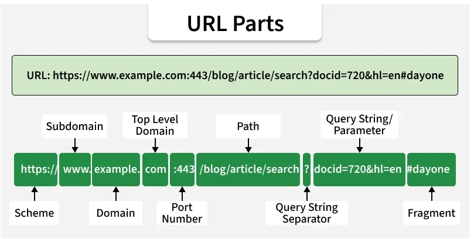

Uniform Resource Locator

A Uniform Resource Locator (URL) is a web address that lets us access all kinds of online content—whether it’s a webpage, a video, a photo, or other media. It guides our browser to the right place on the Internet.

Anatomy of a URL

key components:
    - Scheme: Defines the protocol used to access the resource (e.g., http, https, ftp).

    - Subdomain: Specifies a subdivision of the main domain (e.g., www).

    - Domain: Identifies the main website name (e.g., example).

    - Top-Level Domain (TLD): Indicates the domain extension (e.g., .com, .org).

    - Port Number: Specifies the server port (default: 80 for HTTP, 443 for HTTPS).

    - Path: Points to the resource location on the server.

    - Query String Separator: The ? symbol that starts query parameters.

    - Query String / Parameters: Passes data as key–value pairs using &.

    - Fragment: Refers to a specific section within the resource using #.

**************************************************************
Additional notes

HTTP
HTTP (Hypertext Transfer Protocol) is a communication protocol that defines how data is exchanged between clients and web servers.

- Used to transfer data over the internet.
- Defines request–response communication between client and server.
- Supports transmission of web pages, images, and other resources.
- Stateless protocol by design.

HTTPS
HTTPS (Hypertext Transfer Protocol Secure) is a secure version of HTTP that encrypts data exchanged between clients and servers.

- Uses encryption (SSL/TLS) to protect data.
- Prevents interception and tampering.
- Ensures secure communication between client and server.

difference

HTTP
Stands for: Hypertext Transfer Protocol

Data transmission: Data is sent in plain text

Default port: Uses port 80 by default

Security: No built-in security

Vulnerabilities: Vulnerable to attacks such as MITM (Man-in-the-Middle)

Performance: Faster without encryption overhead

Use case: Used where security is not critical

Requirements: Does not require SSL/TLS certificate

HTTPS
Stands for: Hypertext Transfer Protocol Secure

Data transmission: Data is encrypted using SSL/TLS

Default port: Uses port 443 by default

Security: Provides secure communication via encryption

Vulnerabilities: Resistant to attacks such as MITM (Man-in-the-Middle)

Performance: Slight overhead due to encryption (negligible in modern systems)

Use case: Used where secure data transmission is required

Requirements: Requires SSL/TLS certificate

*** 
HTTP is like sending a postcard: The message is written in plain text on the back. Anyone who handles the letter—the mail carrier, the post office staff, or anyone else who picks it up—can read exactly what you wrote without needing to open an envelope.

HTTPS is like sending a letter in a locked, tamper-proof envelope: The message is encrypted (locked inside the envelope). Even if a malicious person intercepts the letter in transit (a Man-in-the-Middle attack), they cannot read the contents because they don't have the "key" to open the security seal (the SSL/TLS certificate).

*****
Client-Server Model Encryption
Secure communication in the client–server model is achieved through encryption, ensuring data exchanged between clients and servers remains protected.

In the client–server model, a client sends requests and the server returns responses.
Encryption converts data into a secure form to prevent unauthorized access.
HTTPS secures client–server communication using SSL/TLS.
SSL/TLS provide encryption and authentication for secure data transfer.
HTTP transfers data but does not provide encryption.
SSL And TLS Certificates
SSL and TLS are security protocols that encrypt internet communication and verify server identity to ensure secure data transfer.

*****
SSL (Secure Sockets Layer) and TLS (Transport Layer Security) encrypt data between client and server.
Protect communication from interception and unauthorized access.
Use digital certificates to authenticate web servers.
Certificates are issued by trusted Certificate Authorities (CAs).
Clients verify certificates before establishing a secure connection.

******
Public Key and Symmetric Key
Encryption can be classified into public key and symmetric key methods, each using different key mechanisms for securing data.

Public key encryption: Uses a public key for encryption and a private key for decryption.
Public key can be shared openly; private key is kept secret.
Symmetric key encryption: Uses a single shared key for both encryption and decryption.
Symmetric encryption is faster than public key encryption.

**************************************************************

Reference:
https://www.geeksforgeeks.org/computer-networks/components-of-a-url/

https://tryhackme.com/room/webapplicationbasics